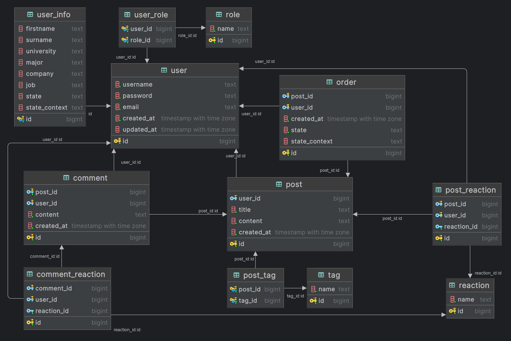

# Blog REST

## Overview

The Blog is a sample application created as an interactive platform for IT students.
Authorized users can leave reactions and write comments.
Both students and company representatives can publish posts, but company representatives,
acting as ambassadors, cannot create posts freely; they must purchase them (e.g., a post about internship recruitment).

When a company representative creates a post, an order is automatically generated.
The post will not be publicly visible until the order is paid.
The application includes validation and allows users to leave reactions on posts or comments,
as well as create comments.

User verification is also present to assign roles as either a student or a company representative.
The application uses Spring Security to ensure that only authorized users can perform certain actions.
It also supports pagination, making it easy to navigate through large amounts of data.

### Pagination and Sorting examples
   
```console  
http://localhost:8080/user
http://localhost:8080/user?pageSize=2
http://localhost:8080/user?pageSize=2&pageNumber=2
http://localhost:8080/user?pageSize=2&pageNumber=2orderBy=asc
```
    
## Schema



## Running the Application

1. **Clone the repository**
    ```console  
    git clone https://github.com/cloudbonus/blog-microservices.git 
    ```
2**Setup**
   - Move content from the util folder to the parent directory.
   - Execute `docker-compose.yaml` to set up Apps, PostgreSQL and Kafka.
   - (OPTIONAL) Execute `init-db.sql` in the resources folder to initialize the database with starter data.

## To-Do

- [ ] Refactor the code.
- [X] Move state machine to another service. 
- [X] Migrate to Spring Boot and Spring Data JPA.
- [ ] Fix bugs (I'm sure they exist).
- [ ] Fix tests
- [ ] Update the database schema.

## Contributing

Feel free to explore the code and make improvements. Contributions are welcome!

## License

This project is released under the [CC0 License](https://choosealicense.com/licenses/cc0-1.0/).
